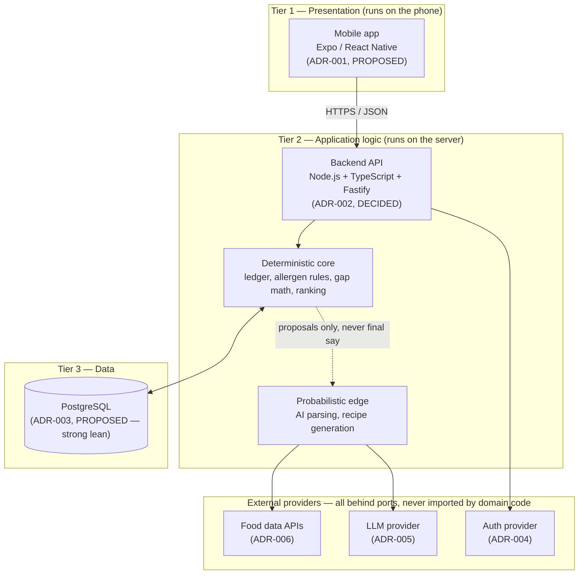
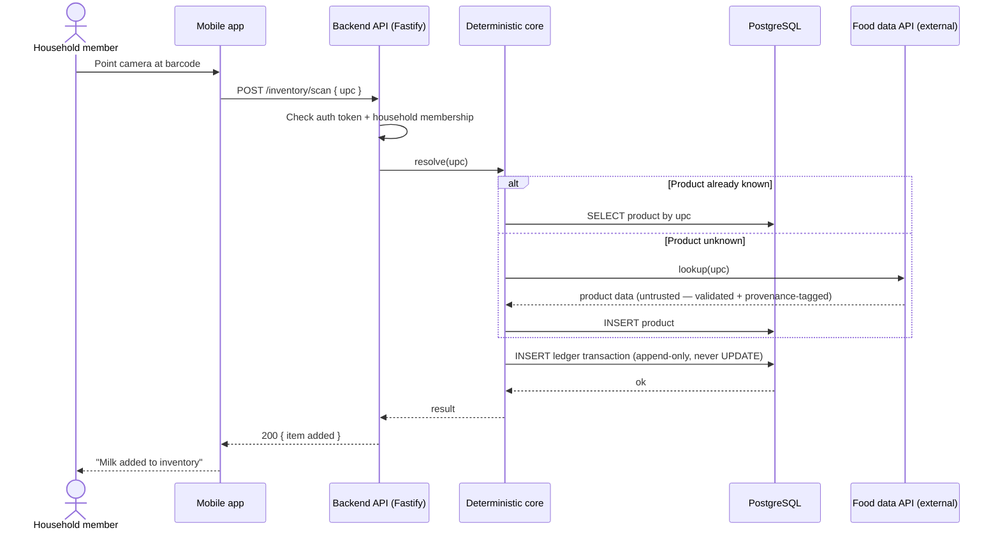
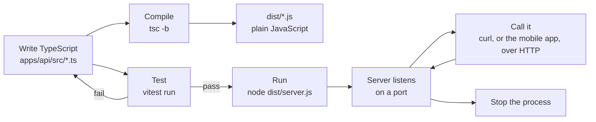
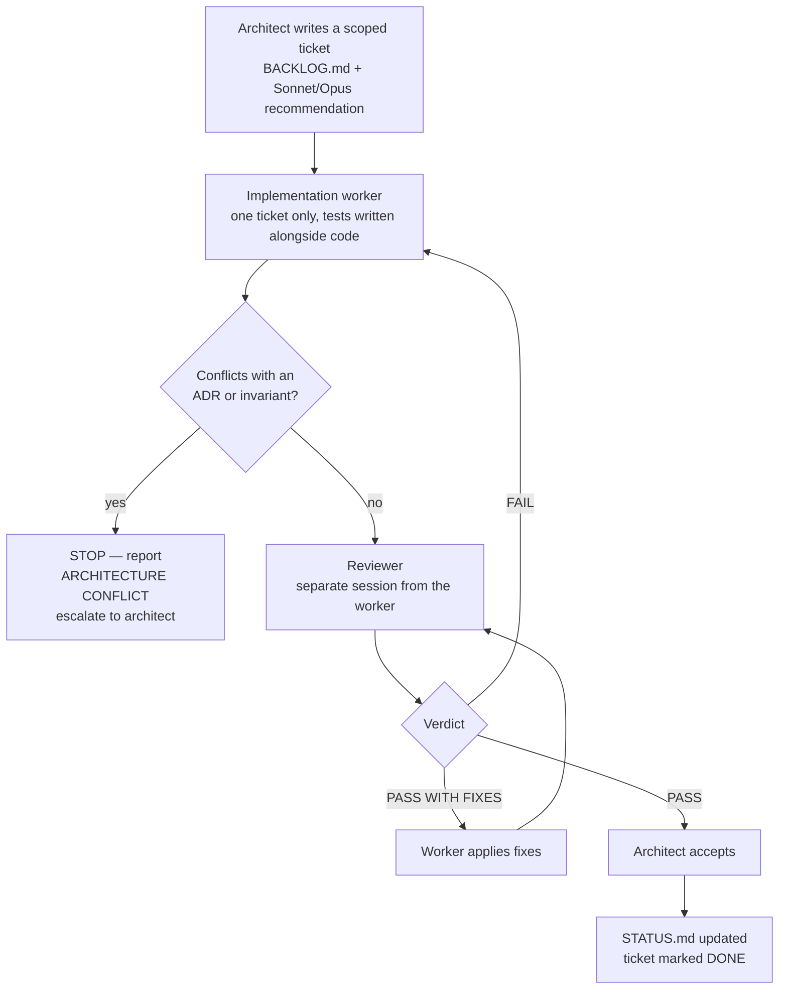

# Workflow & flow diagrams (visual companion)

**Status:** Explanatory reference only — no new decisions live here. Every fact below is restated from [ARCHITECTURE.md](../../ARCHITECTURE.md), [system-context.md](system-context.md), the ADRs in [docs/adr/](../adr/README.md), and [CLAUDE.md](../../CLAUDE.md). If this file and one of those ever disagree, the other doc wins — update this one to match.

Four diagrams: how the system is shaped, what happens on one real request, how code goes from written to running, and how a ticket moves from idea to done.

## 1. System shape — the three tiers

**Reading it:** the phone app never touches the database or an external API directly — everything routes through the backend. Inside the backend, the "deterministic core" (safety math, ledger, allergen rules) only ever *receives proposals* from the AI edge — it never lets AI make the final call. See [ai-architecture.md §1](ai-architecture.md#1-the-boundary-rule).

## 2. One request, start to finish — scanning a barcode

**Reading it:** the inventory change is always an *append* to a transaction log, never an in-place edit — see [ADR-008](../adr/ADR-008-inventory-ledger.md). This diagram is illustrative of the intended shape; the actual routes/modules land ticket by ticket, not all at once.

## 3. Local build/test/run cycle — what happens to the code you write

**Reading it:** this is the exact loop demonstrated live in-session against the real [apps/api/](../../apps/api/) skeleton from ticket M0-T1 — write, compile, test, run, call, stop.

## 4. Ticket workflow — how a change is allowed to become "done"

**Reading it:** rule 26 in [CLAUDE.md](../../CLAUDE.md) — code being written is not the finish line. A ticket is DONE only after tests pass, an independent reviewer signs off, docs are updated, and the architect records acceptance in [STATUS.md](../../STATUS.md).
