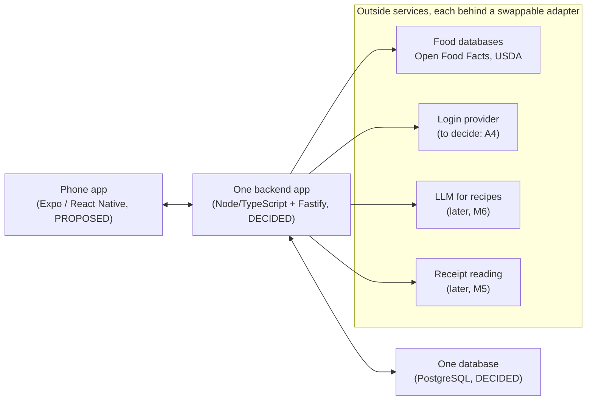

# High-level architecture overview: prep before the decision meeting

**For:** Andy and Dean, before the working session on [decision-brief-2026-09.md](decision-brief-2026-09.md).
**Written:** 2026-09-18 by the architect. Plain language on purpose. Every claim here links to the detailed doc it comes from; nothing in this file is a new decision.

Read this in 15 minutes, then the brief. That is all you need for the meeting.

---

## 1. What we are building, in one paragraph

A phone app that keeps track of what food a household has, so it can tell you what to cook, what you are running out of, and what to buy. The bet is that the hard part is not recipes, it is keeping the inventory right with almost no effort from the user. Everything in the architecture is shaped by that bet and by one safety rule: the app never tells anyone a food is guaranteed safe for their allergies.

Source: [PRODUCT.md](../../PRODUCT.md) (Dean's brief, organised), [docs/prd/MVP_PRD.md](../prd/MVP_PRD.md) (the scoped first version).

## 2. The picture

Three boxes we own, four services we rent or use for free. No microservices, no Kubernetes, no message queues. One backend, one database, on purpose ([ARCHITECTURE.md §1](../../ARCHITECTURE.md), D-004).

Code layout mirrors this: `apps/api` is the backend, `apps/mobile` will be the phone app, `packages/domain` is the pure business logic (the most tested code, no network, no vendor code), `packages/adapters` holds the plugs to outside services.

## 3. Five ideas that explain every design choice

**1. Inventory is a ledger, not a spreadsheet cell.**
Like a bank statement. Every purchase, every use, every toss is a new row. Nobody edits "quantity = 3"; the quantity is computed from the rows. Why: mistakes stay visible and fixable, retries cannot double-count, and we can measure how often the app was wrong (idea 5). Status: DECIDED (ADR-008, D-003), built and tested. [ADR-008](../adr/ADR-008-inventory-ledger.md).

**2. Safety math is plain code, never AI.**
Allergen checks, quantity arithmetic, shopping-gap math, calorie sums: deterministic code with permanent tests. AI (recipe ideas later, receipt reading later) can only propose, and it may add allergen warnings but never remove one. The allergen engine has three answers: blocked, allowed with unknowns, or allowed with known matches only. There is no "safe" answer anywhere in the system or the UI copy. Status: DECIDED (D-014, D-017), built and tested. [ai-architecture.md](../architecture/ai-architecture.md).

**3. Every fact carries a trust tier.**
Known Fact, Estimated, or AI Interpretation. This comes straight from Dean's brief (§14). It shows up as small chips in the UI and as a column in the database. A barcode scan is a Known Fact for identity, but the allergen list from a label database is only Estimated until confirmed (that is decision A8). Status: DECIDED as a principle, built into the schema and the prototype.

**4. Outside services sit behind adapters with fake versions.**
The food database, login, LLM, OCR and file storage are each a "port" with a fixture implementation for tests. This is why we could build and test the whole foundation with zero vendors chosen and zero dollars spent, and why picking a vendor later (A4, A5) is a bounded swap, not a rewrite. Status: DECIDED as a principle (D-009); vendor picks are the open decisions.

**5. Inventory accuracy is the product metric.**
We track the "correction rate": how often a user or the system had to correct what the app believed. A falling rate means the product works. Session counts can look great while the inventory rots. Status: DECIDED and implemented (M1-T7, [ARCHITECTURE.md §8](../../ARCHITECTURE.md)).

## 4. What is decided, what is proposed, what is open

| Area | Status | Where |
|---|---|---|
| Backend: Node/TypeScript + Fastify | DECIDED 2026-09-03 | [ADR-002](../adr/ADR-002-backend-runtime.md) |
| Database: PostgreSQL with row-level security (each household can only see its own rows, enforced by the database itself) | DECIDED 2026-09-10 | [ADR-003](../adr/ADR-003-database.md) |
| Inventory ledger model | DECIDED 2026-09-08 | [ADR-008](../adr/ADR-008-inventory-ledger.md) |
| Allergen policies (deterministic, three-state, fail closed) | DECIDED (D-014, D-017) | [DECISIONS.md](../../DECISIONS.md) |
| Visual design direction v2 (terracotta, Fraunces/Inter, provenance chips) | DECIDED 2026-09-15 (D-019) | [design-direction.md](../design/design-direction.md) |
| Phone app: Expo / React Native | PROPOSED, needs Andy (A6) | [ADR-001](../adr/ADR-001-client-platform.md) |
| Login: open-source library inside our backend (Better Auth), fallback Supabase Auth | PROPOSED, needs Andy (A4) | [ADR-004](../adr/ADR-004-authentication.md), brief B1 |
| Hosting: nothing until Dean needs a shared backend, then one small VPS at about $5/month | PROPOSED, needs Andy (A5) | brief B2 |
| Food data: Open Food Facts + USDA first, commercial only if coverage disappoints | PROPOSED on measured evidence | [ADR-006](../adr/ADR-006-food-data-sources.md) |
| MVP scope (which features are in the first version) | PROPOSED, needs Dean (A1 = D-002) | [MVP_PRD.md §3](../prd/MVP_PRD.md) |
| LLM vendor, OCR vendor, file storage, full offline mode | OPEN, not needed yet | ADR-005/007/009/010 |

The pattern: everything that is expensive to change later is decided. Everything that is a swap behind an adapter is still open, and can stay open at zero cost until we need it.

## 5. What actually exists today

- The full documentation set (product, PRD, architecture, decisions, backlog).
- Working, reviewed, merged code for the foundation: inventory ledger, units engine, allergen rule engine, food-lookup adapters with a test corpus, the Postgres schema with tenant isolation and append-only enforcement, correction-rate telemetry, first-expiry-first-out lot picking, retry and transaction-safety helpers. 786 automated tests, CI green.
- A 14-screen clickable prototype (open it on a phone: [smart-kitchen-prototype.html](../design/mockups/smart-kitchen-prototype.html)), a binding copy deck for every safety string, and a measured colour token sheet.
- No phone app code yet. No backend endpoints yet. No cloud resources, no vendor accounts, no money spent.

Live status: [STATUS.md](../../STATUS.md).

## 6. Roadmap, and where the meeting's decisions land

| Milestone | What it delivers | Gated by |
|---|---|---|
| M0, M1 | Foundation (done) | nothing |
| M2 | Backend API: households, inventory endpoints, login | A4 login approach, A5 hosting, or a yes to A7 (build with a stub login first, swap later, $0) |
| M3 | The phone app | A1 (D-002 scope), A6 (Expo), design sign-off, A12 colour darkenings |
| M4 | Barcode scanning against real food data | A8 (label-data trust tier), a free USDA API key (needs your approval per rule 17) |
| M5 | Receipt photos (fast-follow) | OCR vendor bake-off, first metered spend |
| M6 | Recipe recommendations | LLM vendor by eval, first metered spend |
| M7, M8, M9 | Shopping loop, consumption and reconciliation (A9 shortfall policy), hardening | later |

On the recommended path the only cash before beta is $99/year Apple and $25 Google when Dean needs store builds, and about $5/month once a shared backend is needed. Details in the brief, Part B.

## 7. Who decides what at the meeting

- **Dean:** A1 MVP scope (the big one), A2 launch market, A9 shortfall policy.
- **Andy:** A4 login approach, A5 hosting, A6 Expo, A7 stubbed-login M2 go/no-go, A11 imagery licensing, A12 colour darkenings.
- **Both:** A3 household permissions, A8 label-data trust tier, A10 UX opens including the product name.

Heads-up on the name: "KitchenSmart" is a placeholder. Do a trademark search before buying a domain or signing up anywhere under it (brief B7).

## 8. Glossary for the meeting

- **ADR:** Architecture Decision Record. A one-page "why we chose X" document in [docs/adr/](../adr/README.md). Ten exist; three are decided.
- **D-number:** an entry in [DECISIONS.md](../../DECISIONS.md), the log of every product and engineering decision. D-002 is the MVP scope.
- **A-number:** an item in the decision brief's Part A.
- **M-number, ticket (M1-T4 etc.):** milestones and work items in [BACKLOG.md](../../BACKLOG.md).
- **INV-*:** a permanent invariant test, for example "the ledger always reconciles" or "a household never sees another household's rows".
- **Provenance / tier:** the Known Fact, Estimated, AI Interpretation label on a fact.
- **Port / adapter:** the plug-shaped interface to an outside service, and a specific implementation of it (fixture, Open Food Facts, and so on).
- **RLS:** row-level security in PostgreSQL. The database itself refuses to show one household's rows to another.
- **FEFO:** first expiry, first out. Which lot the app assumes you used when you cook.
- **Correction rate:** the primary product metric, see idea 5.

## 9. If you have another 20 minutes

1. [MVP_PRD.md §3](../prd/MVP_PRD.md) for the exact scope cut Dean is ratifying.
2. [ARCHITECTURE.md §3](../../ARCHITECTURE.md) for the table of technology options weighed, with the reasons.
3. [ARCHITECTURE.md §7](../../ARCHITECTURE.md) for the security and privacy list. Allergy data is health-adjacent, which is why the launch market (A2) matters for GDPR.

Skip BACKLOG.md and the docs/architecture folder unless a specific question comes up. They are engineering detail.
